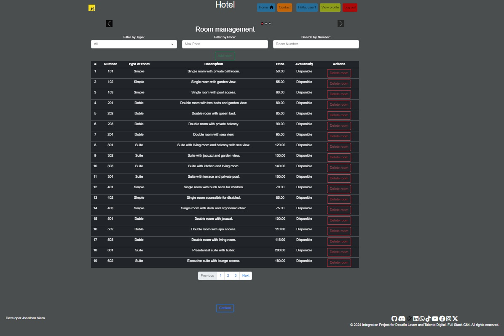
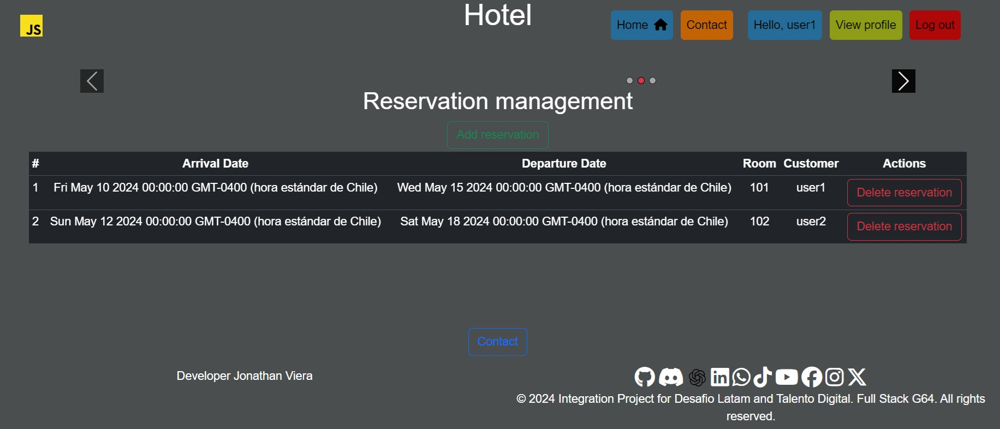
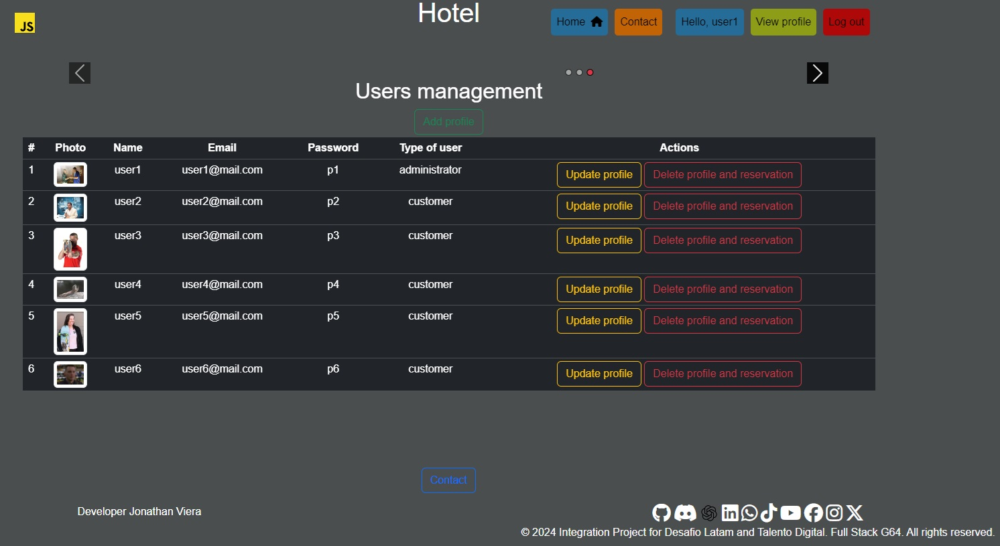
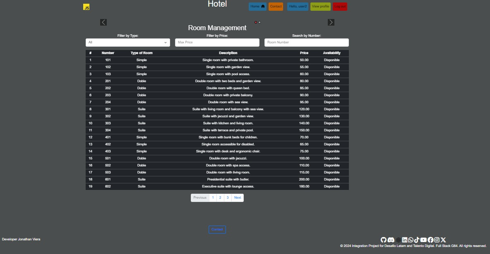
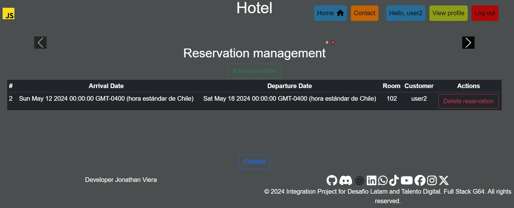

# <h1 class="text-center"> 🚀---- MODULE 8-Certification test. <br> Hotel Reservation Management System. ---- </h1>

 # 📌 Index of contents.

1. [requirements in english and spanish: ](#requirements-in-english-and-spanish)
2. [photos of requirements: ](#photos-of-requirements)
3. [ Development Languages and Tools: ](#tools)
4. [ project screenshots: ](#project-screenshots)
5. [prerequisites for installation: ](#prerequisites-for-installation)
6. [Project Installation: ](#Project-Installation)
7. [Create database: ](#Create-database)
8. [Gratitude](#Gratitude)
9. [License](#License)
10. [Authors](#Authors)
11. [folders](#folders)

## Sección 1: requirements in english and spanish <a name="requirements-in-english-and-spanish"></a>

<details>
  <summary>Sección 1.A: requirements in english</summary>   
    <div>
        <p>
            Test hotel reservation management system. Congratulations on getting this far! This project is the pinnacle of everything you have learned so far in the course. Here, you will put your development skills to the test, to build a reservation management system that is functional, attractive and adaptable to different devices. The objective of this test is to develop a complete and dynamic web application that functions as a centralized hotel reservation management system. This system will allow users (administrator and guest) to efficiently manage all aspects related to reservations. Don't worry, you won't be alone. A team has been designated that will provide you with the necessary information to proceed with the development of the project: Detailed project information, flow diagram, physical model, wireframes at the end of the document. Functional system requirements: responsive fronted: use html, css (Bootstrap) and javascript to create a fronted that adapts to various devices, implement an intuitive design that facilitates navigation and user interactions. Data model: Users: detail such as username, email, password and user type. (Administrator, guest). Any user who registers will be a guest until they are changed to administrator. Rooms: information such as room type number (single, double or suite), description, price and availability. Reservations: Information about the reservation request, delivery dates, departure date, selected rooms and associated guest. Room types: types available, single double and suite. Contact: fields for name, email and message. Functionalities The root route must reach the home page, there must be a contact view with its respective form. If the user is not authenticated, they would not be able to enter the CRUD of /rooms and /reservations. If you try to access views other than home and contact, you will be redirected to the start section view. Upon authentication you will be sent to view/rooms. The login and register links will be displayed in the navigation bar if the user is not authenticated. By clicking on them, you will be redirected to your corresponding visits. If the user is authenticated, the username and a link to close the section will be displayed in the navigation bar. Which will redirect you to the start section view when you click on it, the /rooms view should show 10 of the available rooms through pagination and have a filter where the user can filter by type and price. Administrator users will be able to generate rooms from the /room/new view. But the guest type user only has permissions to view the list of available rooms. The /room/id view should show all the room information and allow reservations to be made using a form where the check-in date and check-out date will be inserted. There must be a list of /reservations in which the administrator user. You will have the list of reserved rooms and you will be able to manage the status of available rooms to occupied. Database: create a file called "reservas_hotel.sql" that contains the database creation process, the tables with their restrictions and relationships. Seed data: The creation of seed data for the project database tables is requested. This data can be included within the file, "reservas_hotel.sql" or in a separate file in CSV format called "reservas_hotel.csv". Non-functional requirements: project name: hotel_reservations. Fronted technologies: HTML, css, Bootstrap, JavaScript, jQuery, handlebars.js. Backend technologies: node.js, express, node.js libraries. Database: PostgreSQL, ORM, the use of an ORM is allowed for database connection and logic. Database name: hotel_reservations. Code organization: keep database connection logic separate in a file, keep database queries separate, keep server logic separate. Required files packet. json, packet-lock. json, readme.md. Individual development: the development of the test must be individual. Restrictions: it is prohibited to upload the code to Github or share it on platforms or with other students. Deliverables: compressed files: the source code of the project must be compressed in a file with the extension ".zip" if the file must have the name of the project "reservas_ hotel.zip", separated by underscores without spaces or capital letters, it is not You must not include either the ".git" folder or the "node_modules" folder in the zip file. SQL files: a file with a ".sql" extension must be included that contains the commands for creating the database, tables and inserting data. The file should be called "hotel reservations.sql" and should go inside the project folder. Readme.md: Readme.md file with the following sections: Project name, hotel reservation management system. Project Description: Use the requirements paragraph, screenshot of the project, include screenshots of the following views: home, registration, rooms, room/id, reservation/new. Prerequisites or dependencies to install. Project installation. Command to run the project. Command to load the database or look at the models. Command to load the seed data to the database. Access credentials according to user type, after loading the seed data: For administrator type user: email: administrator@mail.com password: Abc123·. For guest type user: email: huesped@mail.com password: Abc123·. You can use the following template as a reference to generate your readme.md file: https://github.com/brayandiazc/template-readme-es. Recommendations: requirements and deliverables: Carefully read each of the requirements and deliverables before starting. Folder Creation Create a folder with the name "hotel reservation" for your project. Project initialization with node.js: Initialize your project with node.js using the following command. npm init -y . Installation of the libraries: install the necessary libraries with the following command: npm install express, nodemon, libraries. Files A server.js file is generated to handle the server logic. Generate a db.js file for database configuration, database configuration, configure your connection to the PostgreSQL database. Use primary keys on all tables. ID serial primary key. Use foreign keys whenever necessary. Foreign key. Using git while developing the project. Gitignore file generates a gitignore file with the following configuration: Use of handlebars and Bootstrap: use of handlebars.js to work with templates and components in the views use the bootstrap components in conjunction with CSS to style your views you can find the documentation from Bootstrap: Add javascript dependencies to your project if necessary. 
        </p>
    </div>
</details>

<details>
  <summary>Sección 1.B: requirements in spanish</summary>  
    <div>
        <p>
            Prueba sistema de gestión de reservas para hotel. ¡Felicidades por llegar hasta aquí!. Este proyecto es el pináculo de todo lo que has aprendido hasta ahora en el curso. Aquí, pondrás a prueba tus habilidades de desarrollo, para construir un sistema de gestión de reservas que sea funcional, atractivo y adaptable a distintos dispositivos. El objetivo de esta prueba es desarrollar una aplicación web completa y dinámica que funcione como un sistema centralizado de gestión de reservas de hoteles. Este sistema permitirá a los usuarios (administrador y huésped) gestionar eficientemente todos los aspectos relacionados con las reservas. No te preocupes, no estarás solo. Se ha designado un equipo que te hará entrega de la información necesaria para proceder con el desarrollo del proyecto: Información detallada del proyecto, diagrama de flujo, modelo físico, wireframes al final del documento. Requerimientos funcionales del sistema: fronted responsivo: utilizar html, css (Bootstrap) y javascript para crear un fronted que se adapte a varios dispositivos, implementar un diseño intuitivo que facilite la navegación y las interacciones de los usuarios. Modelo de datos: Usuarios: detalle como nombre de usuario, correo electrónico, contraseña y tipo de usuario. (Administrador, huésped). todo usuario que se registre será un huésped hasta que se le cambie a administrador. Habitaciones: información como número de habitación tipo (simple, doble o suite) descripción, precio y disponibilidad. Reservas: información sobre la solicitud de reservas, fechas de entrega, fecha de salida, habitaciones seleccionadas y huésped asociado. Tipos de habitaciones: tipos disponibles, simple doble y suite. Contacto: campos para nombre, correo electrónico y mensaje. Funcionalidades la ruta a raíz debe llegar a la página de inicio, debe existir una vista de contacto con su respectivo formulario. Si el usuario no se encuentra autenticado, no podría ingresar al CRUD de /habitaciones y /reservas. Si trata de acceder a otras vistas diferentes a inicio y contacto será redireccionado a la vista de iniciar sección. Al autenticarse será enviado a la vista /habitaciones. Los enlaces de iniciar sesión y registrarse se mostrarán en la barra de navegación si el usuario no autenticado. Al pulsarlos, redireccionara a sus visitas correspondientes. Si el usuario está autenticado en la barra de navegación se mostrará su username y un enlace para cerrar sección. El cual lo redireccionará a la vista de iniciar sección al hacer clic en él, la vista de /habitaciones debe mostrar 10 de las habitaciones disponibles mediante paginación y contar con un filtro donde la el usuario podrá filtrar por tipo y precio. Los usuarios de tipo administrador podrán generar las habitaciones desde la vista /habitación/nueva. Pero el usuario de tipo huésped solo tiene permisos para visualizar el listado de habitaciones disponibles. La vista /habitación/id debe mostrar toda la información de la habitación y permitir hacer reservas mediante un formulario donde se insertarán la fecha de ingreso y la fecha de salida. Debe existir una lista de /reservas en la cual el usuario administrador. Tendrá el listado de las habitaciones reservadas y podrá gestionar el estado de las habitaciones disponibles a ocupada. Base de datos: crea un archivo llamado "reservas_ hotel.sql" que contenga el proceso de la creación de la base de datos, las tablas con sus restricciones y relaciones. Datos semilla: Se solicita la creación de datos semillas para las tablas de la base de datos del proyecto. Estos datos pueden estar incluidos dentro del archivo, "reservas_ hotel.sql"o en un archivo separado en formato CSV llamado "reservas_ hotel.csv".  Requerimientos no funcionales: nombre del proyecto: reservas_ hotel. Tecnologías fronted: HTML, css, Bootstrap, JavaScript, jQuery, handlebars.js. Tecnologías backend: node.js, express, librerías de node.js. Base de datos: PostgreSQL, ORM, se permite que el uso de un ORM para la conexión y lógica de la base de datos. Nombre de la base de datos: reservas_ hotel. Organización del código: mantener separada a la lógica de conexión a la base de datos en un archivo, mantener separadas las consultas a la base de datos, mantener separada la lógica del servidor. Archivos requeridos packet. json, packet-lock. json, readme.md. Desarrollo individual: el desarrollo de la prueba debe ser individual. Restricciones: se prohíbe subir el código a Github o compartirlo en plataformas o con otros estudiantes. Entregables: archivos comprimido: el código fuente del proyecto debe estar comprimido en un archivo con la extensión ".zip" si el archivo debe llevar el nombre del proyecto "reservas_ hotel.zip", separado por guiones bajos sin espacios ni mayúscula, no se debe incluir la carpeta ".git" ni la carpeta "node_modules" en el archivo comprimido. Archivos SQL: se debe incluir un archivo con extensión ".sql" que contenga los comandos para la creación de la base de datos, tablas e inserción de datos. El archivo debe llamarse "reservas hotel.sql" Y debe ir dentro de la carpeta del proyecto. Readme.md: Archivo readme.md con las siguientes secciones: Nombre del proyecto, sistema de gestión de reservas para hotel. Descripción del proyecto: utiliza el párrafo de objetivos, captura de pantalla del proyecto, incluir capturas de pantalla de las siguientes vistas: home, registro, habitaciones, habitación/id, reserva/nueva. Prerequisitos o dependencias a instalar. Instalación del proyecto. Comando para ejecutar el proyecto. Comando para cargar la base de datos o mirar los modelos. Comando para cargar los datos semilla a la base de datos. Credenciales de acceso según tipo de usuario, luego de cargar los datos semilla: Para usuario de tipo administrador: email: administrador@mail.com contraseña: Abc123·. Para usuario tipo huésped: email: huesped@mail.com contraseña: Abc123·. Puedes usar la siguiente plantilla como referencia para generar tu archivo readme.md: https://github.com/brayandiazc/template-readme-es. Recomendaciones: requerimientos y entregables: Lee cuidadosamente cada uno de los requerimientos y entregables antes de comenzar. Creación de la carpeta crea una carpeta con el nombre de "reserva hotel" para tu proyecto. Inicialización del proyecto con node.js: inicializa tu proyecto con node.js usando el siguiente comando. npm init -y . Instalación de las librerías: instalar las librerías necesarias con el siguiente comando: npm install express, nodemon, librerías. Archivos se genera un archivo server.js para manejar la lógica del servidor. Genera un archivo db.js para la configuración de la base de datos, configuración de la base de datos, configurar tu conexión a la base de datos PostgreSQL. Utiliza llaves primarias en todas las tablas. ID serial primary key. Usa las llaves foráneas siempre que sean necesarias. Foreign key. Uso de git mientras estás desarrollando el proyecto. Archivo gitignore genera un archivo gitignore con la siguiente configuración: Uso de handlebars y Bootstrap: uso de handlebars.js para trabajar con plantillas y componentes en las vistas utiliza los componentes de bootstrap en conjunto con CSS para dar estilos a tus vistas puedes encontrar la documentación de Bootstrap:. Agrega las dependencias de javascript a tu proyecto de ser necesarias.  
        </p>
    </div>
</details>

## Sección 2: photos of requirements <a name="photos-of-requirements"></a>

<details>
  <summary>Sección 2: photos of requirements</summary>
    <div>
        
        
        
        
        
        
        
    </div>
</details>

## Sección 3: 👨🏽‍💻 Development Languages and Tools:  <a name="tools"></a>

<details>
  <summary>Sección 3:  👨🏽‍💻Development Languages and Tools: </summary>  
    <div>
         &nbsp;
         &nbsp;
         &nbsp; &nbsp;
         &nbsp; &nbsp;
         &nbsp; &nbsp;
         &nbsp; &nbsp;
         &nbsp; &nbsp;
         &nbsp; &nbsp; 
         &nbsp; &nbsp; 
         &nbsp; &nbsp; 
         &nbsp; &nbsp;  
         &nbsp; &nbsp; 
         &nbsp; &nbsp; 
         &nbsp; &nbsp; 
         &nbsp; &nbsp; 
         &nbsp; &nbsp; 
    </div>
</details>

## Sección 4: project screenshots 🏆 <a name="project-screenshots"></a>

<details>
  <summary>Sección 4: project screenshots </summary>
    <div>        
        ### Home.hbs
        
        ### Registro.hbs
                
        ### Login.hbs
        
        ### Contacto.hbs
        
        ### Admin.hbs room
                
        ### Admin.hbs reservation
                
        ### Admin.hbs user
                
        ### Customer.hbs room
                
        ### Customer.hbs reservation
                
        ### Perfil.hbs
        
        ### AddReservation.hbs
                
        ### AddRoom.hbs
                
        ### Undefined.hbs
        
    </div>
</details>

## Sección 5: 📋 prerequisites for installation <a name="prerequisites-for-installation"></a>

<details>
  <summary>Sección 5: prerequisites for installation</summary>
    <div>
        <p>
            These instructions will guide you to get a copy of this project up and running on your local machine for development and testing purposes.
            List of software and tools, which you need to install and run this project:
            - Operating System (e.g. Windows 11)
            - code editor (e.g. visual Studio Code or Atom)
            - Database (e.g. PostgreSQL, Dbeaver or Neon)
            - Internet to run it in Render
            - You must have the node application configured in Gmail so that the nodemailer dependency can send and receive email when you submit a contact form. you need to go to gmail account settings and search for "Application Passwords" and create one for node.js
        </p>
    </div>
</details>

## Sección 6: 🔧 Project Installation ⚙️ <a name="Project-Installation"></a>

<details>
  <summary>Sección 6: Project Installation</summary>     
        installing the dependencies in Node.js with the following command :
installing the dependencies in Node.js with the following command :
📦Build Command...

```bash
# npm i
```

Start Command...

```bash
# npm start
```
               
</details>

## Sección 7: ⌨️ Create database and view access credentials 🛠️ <a name="Create-database"></a>

<details>
  <summary>Sección 7_1: Create database</summary>
    <div>
        <p>-- Create the database--------
            CREATE DATABASE reservas_hotel;          
        </p>
    </div>
</details>

<details>
  <summary>Sección 7_2: Create the table tiposhabitaciones</summary>
    <div>
        <p>-- Create the table tiposhabitaciones
            CREATE TABLE tiposhabitaciones (
                id SERIAL PRIMARY KEY,
                tipo VARCHAR(50) NOT NULL
            );
        </p>
    </div>
</details>

<details>
  <summary>Sección 7_3: Create the table habitaciones</summary>
    <div>
        <p>-- Create the table habitaciones-----
            CREATE TABLE habitaciones (
                id SERIAL PRIMARY KEY,
                numero INT NOT NULL,
                tipo_habitacion_id INT REFERENCES tiposhabitaciones(id),
                descripcion TEXT,
                precio DECIMAL(10, 2),
                disponibilidad BOOLEAN
            );
        </p>
    </div>
</details>

<details>
  <summary>Sección 7_4: Create the table usuarios</summary>
    <div>
        <p>-- Create the table usuarios------
            CREATE TABLE usuarios (
                id SERIAL PRIMARY KEY,
                username VARCHAR(50) NOT NULL,
                email VARCHAR(100) NOT NULL,
                password VARCHAR(100) NOT NULL,
                tipo_usuario VARCHAR(50),
                foto VARCHAR(255)
            );
        </p>
    </div>
</details>

<details>
  <summary>Sección 7_5: Create the table reservas</summary>
    <div>
        <p>-- Create the table reservas-------
            CREATE TABLE reservas (
                id SERIAL PRIMARY KEY,
                fecha_reserva DATE,
                fecha_salida DATE,
                habitacion_id INT REFERENCES habitaciones(id),
                cliente_id INT REFERENCES usuarios(id)
            );
        </p>
    </div>
</details>

<details>
  <summary>Sección 7_6: Create the table contactos</summary>
    <div>
        <p>-- Create the table contactos--------
            CREATE TABLE contactos (
                id SERIAL PRIMARY KEY,
                nombre VARCHAR(100),
                email VARCHAR(100),
                mensaje TEXT
            );
        </p>
    </div>
</details>

<details>
  <summary>Sección 7_7: Insert data into the table tiposhabitaciones</summary>
    <div>
        <p>-- Insert data into the table tiposhabitaciones----------
            INSERT INTO tiposhabitaciones (tipo) VALUES
            ('single'),
            ('double'),
            ('suite');            
        </p>
    </div>
</details>

<details>
  <summary>Sección 7_8: Insert 20 rows into the table habitaciones</summary>
    <div>
        <p>-- Insert 20 rows into the table habitaciones, ensuring they match the three existing types------
            INSERT INTO habitaciones (numero, tipo_habitacion_id, descripcion, precio, disponibilidad) VALUES
            (101, 1, 'Single room with private bathroom.', 50.00, true),
            (102, 1, 'Single room with garden view.', 55.00, true),
            (103, 1, 'Single room with pool access.', 60.00, true),
            (201, 2, 'Double room with two beds and garden view.', 80.00, true),
            (202, 2, 'Double room with queen bed.', 85.00, true),
            (203, 2, 'Double room with private balcony.', 90.00, true),
            (204, 2, 'Double room with sea view.', 95.00, true),
            (301, 3, 'Suite with living room and balcony with sea view.', 120.00, true),
            (302, 3, 'Suite with jacuzzi and garden view.', 130.00, true),
            (303, 3, 'Suite with kitchen and living room.', 140.00, true),
            (304, 3, 'Suite with terrace and private pool.', 150.00, true),
            (401, 1, 'Single room with bunk beds for children.', 70.00, true),
            (402, 1, 'Single room accessible for disabled.', 65.00, true),
            (403, 1, 'Single room with desk and ergonomic chair.', 75.00, true),
            (501, 2, 'Double room with jacuzzi.', 100.00, true),
            (502, 2, 'Double room with spa access.', 110.00, true),
            (503, 2, 'Double room with living room.', 115.00, true),
            (601, 3, 'Presidential suite with butler.', 200.00, true),
            (602, 3, 'Executive suite with lounge access.', 180.00, true),
            (603, 3, 'Family suite with two bedrooms.', 160.00, true);            
        </p>
    </div>
</details>

<details>
  <summary>Sección 7_9: Insert data into the table usuarios and view access credentials </summary>
    <div>
        <p>-- Insert data into the table usuarios-----------------------------------
            INSERT INTO usuarios (username, email, password, tipo_usuario, foto) VALUES
            ('user1', 'user1@mail.com', 'p1', 'administrator', 'adam_feliz.jpg'),
            ('user2', 'user2@mail.com', 'p2', 'customer', 'adam.jpg'),
            ('user3', 'user3@mail.com', 'p3', 'customer', 'Danny.jpg'),
            ('user4', 'user4@mail.com', 'p4', 'customer', 'drama.jpg'),
            ('user5', 'user5@mail.com', 'p5', 'customer', 'evelien.jpg'),
            ('user6', 'user6@mail.com', 'p6', 'customer', 'jim.jpg'),
            ('user7', 'user7@mail.com', 'p7', 'customer', 'NOO.jpg'),
            ('user8', 'user8@mail.com', 'p8', 'customer', 'tony.jpg'),
            ('user9', 'user9@mail.com', 'p9', 'customer', 'yoda.jpg'),
            ('user10', 'user10@mail.com', 'p10', 'customer', 'adam.jpg');
        </p>
    </div>
</details>

## Sección 8: Expressions of Gratitude 🎁 <a name="Gratitude"></a>

<details>
  <summary>Sección 8: Expressions of Gratitude </summary>  

  I am grateful for the teaching of [Academia Latam](https://desafiolatam.com/). If you found any value in this project or want to contribute, here's what you can do:
    - Share this project with others
    - Invite me a tea ☕
    - Show your appreciation by saying thank you.
</details>

## Sección 9: License 📄 <a name="License"></a>

<details>
  <summary>Sección 9: License</summary>  

  This project is under the XYZ License - see the file [LICENSE.md](LICENSE.md) for details.  
</details>

## Sección 10: Authors ✒️ <a name="Authors"></a>

<details>
  <summary>Sección 10: Authors</summary> 
  
  - **Jonathan Viera L** - _Initial work_ - [Jonathan Viera L](https://github.com/jviera100/m8d35Hotel)

⌨️ with ❤️ by [Jonathan Viera L](https://github.com/jviera100) 😊 
</details>

## Sección 11: Project structure 🗺️ <a name="folders"></a>

<details>
  <summary>Sección 11_1: model view controller and requests HTTP (MVC) </summary> 
    
         
</details>

<details>
  <summary>Sección 11_2: folder structure</summary>
    

- m8d35Hotel/
  - ├── assets/
  - │   ├── css/
  - │   │    ├── alerta-bootstrap.css
  - │   │    ├── body.css
  - │   │    ├── card.css
  - │   │    ├── carousel.css
  - │   │    ├── modal.css
  - │   │    └── navbar.css
  - │   ├── js/
  - │   │    ├── alert-tooltip.js
  - │   │    ├── api.js
  - │   │    ├── button-pdf.js
  - │   │    ├── card.js
  - │   │    ├── color-change-title.js
  - │   │    ├── image-rotation.js
  - │   │    ├── navbar-toggler-rotation.js
  - │   │    └── parpadea-blinking-fadetoggle.js
  - │   ├── img/
  - │   │    ├── 1.jpg
  - │   │    └── 2.jpg
  - │   └── documents/
  - │             ├── comandos-node-npm-express-json.md
  - │             └── Prueba-JavaScript-01.pdf
  - ├── middlewares/
  - │             ├── middlewares.js
  - │             └── token.js
  - ├── node_modules/
  - ├── routes/
  - │        └── routes.js   
  - ├── src/
  - │   ├── controllers/
  - │   │             └── ApiRestFull.js
  - │   ├── models/
  - │   │        ├── config/
  - │   │        │        └── db.js
  - │   │        └── db/
  - │   │             └── comandos.sql
  - │   ├── queries/
  - │   │         └── consultas.js
  - │   └── views/
  - │           ├── layouts/
  - │           │         └── main.hbs
  - │           ├── partials/
  - │           │         ├── footer.hbs
  - │           │         └── menu.hbs
  - │           ├── AddReservation.hbs
  - │           ├── AddRoom.hbs
  - │           ├── Admin.hbs
  - │           ├── contacto.hbs
  - │           ├── Customer.hbs
  - │           ├── Home.hbs
  - │           ├── Login.hbs
  - │           ├── Perfil.hbs
  - │           ├── Registro.hbs  
  - │           └── undefined.hbs
  - ├── .env
  - ├── .gitignore
  - ├── index.js
  - ├── package-lock.json
  - ├── package.json
  - └── README.md
 
</details>

<details>
  <summary>Sección 11_3: folder description</summary> 

## Description of Main Directories

- **assets/**: Contains resources such as CSS style sheet files, JS scripts, images and documents.
- **middlewares/**: Middlewares for the application and token.
- **node_modules/**: Node.js modules used in the project.
- **routes/**: Routes for the application and email sending configuration.
- **src/**: contains controller, model, queries and views folders.
- - **controller/**: Controllers that handle application requests.
- - **model/**: Data models for the application. It contains the db and config folders.
- - - **config/**: contains db.js file for connecting to the database.
- - - **db/**: Contains the commands to create the local database in postgre.
- - **queries/**: SQL query files for the database.
- - **views/**: Views of the application, including pages, layouts and partials.

## Other Files and Directories

- **.env**: Environment variables configuration file.
- **.gitignore**: File to specify which files and directories should be ignored in Git.
- **index.js**: Main application file.
- **package-lock.json**: Version lock file for Node.js dependencies.
- **package.json**: Node.js project configuration file.
- **README.md**: This documentation file. 
</details>


    


