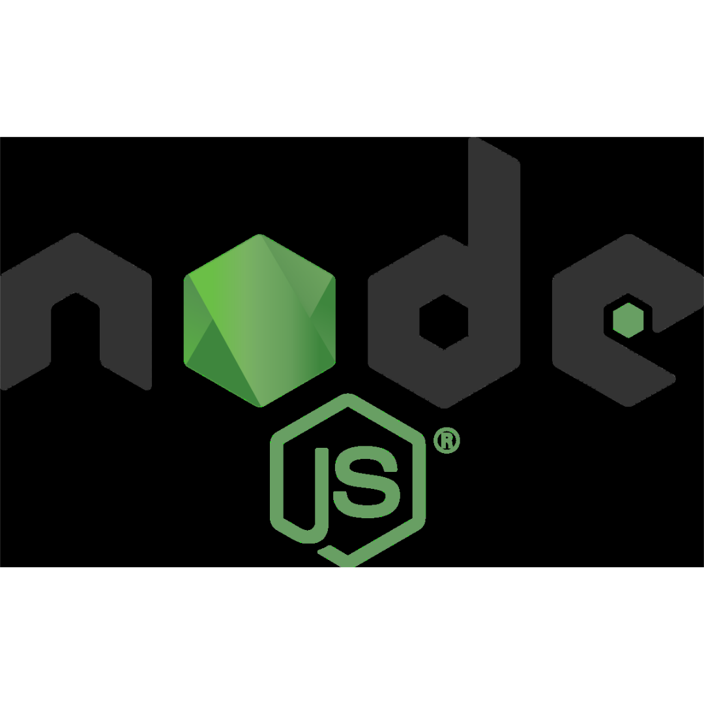
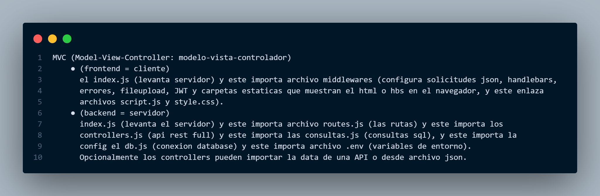
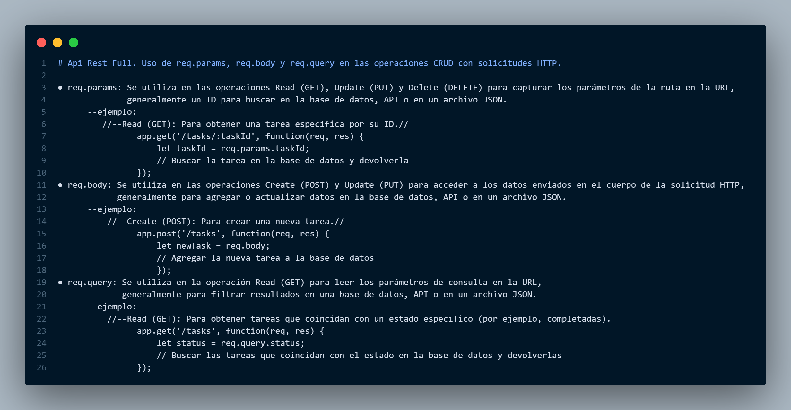
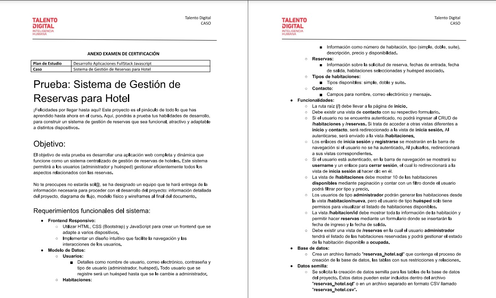
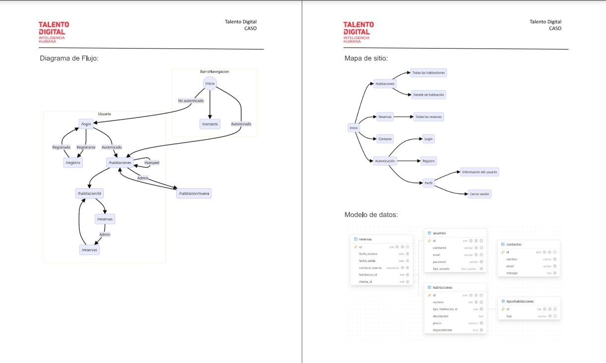

# //--------MODULO 8-Prueba de certificacion--------
 👨🏽‍💻Development Languages and Tools::
   
 &nbsp;
 &nbsp;
 &nbsp; &nbsp;
     &nbsp; &nbsp;
     &nbsp; &nbsp; 
     &nbsp; &nbsp; 
     &nbsp; &nbsp; 
     &nbsp; &nbsp;  
     &nbsp; &nbsp; 
     &nbsp; &nbsp; 
     &nbsp; &nbsp; 

 
🚀[token](https://m8d33pruebaskate.onrender.com)
 
# estructura de carpetas => modelo vista controlador (MVC)
//importaciones = 
index <= rutas <= controller <= data
👨🏽‍💻

    
      

www.desafiolatam.com
  

    Prueba sistema de gestión de reservas para hotel. ¡Felicidades por llegar hasta aquí!. Este proyecto es el pináculo de todo lo que has aprendido hasta ahora en el curso. Aquí, pondrás a prueba tus habilidades de desarrollo, para construir un sistema de gestión de reservas que sea funcional, atractivo y adaptable a distintos dispositivos. El objetivo de esta prueba es desarrollar una aplicación web completa y dinámica que funcione como un sistema centralizado de gestión de reservas de hoteles. Este sistema permitirá a los usuarios (administrador y huésped) gestionar eficientemente todos los aspectos relacionados con las reservas. No te preocupes, no estarás solo. Se ha designado un equipo que te hará entrega de la información necesaria para proceder con el desarrollo del proyecto: Información detallada del proyecto, diagrama de flujo, modelo físico, wireframes al final del documento. Requerimientos funcionales del sistema: fronted responsivo: utilizar html, css (Bootstrap) y javascript para crear un fronted que se adapte a varios dispositivos, implementar un diseño intuitivo que facilite la navegación y las interacciones de los usuarios. Modelo de datos: Usuarios: detalle como nombre de usuario, correo electrónico, contraseña y tipo de usuario. (Administrador, huésped). todo usuario que se registre será un huésped hasta que se le cambie a administrador. Habitaciones: información como número de habitación tipo (simple, doble o suite) descripción, precio y disponibilidad. Reservas: información sobre la solicitud de reservas, fechas de entrega, fecha de salida, habitaciones seleccionadas y huésped asociado. Tipos de habitaciones: tipos disponibles, simple doble y suite. Contacto: campos para nombre, correo electrónico y mensaje. Funcionalidades la ruta a raíz debe llegar a la página de inicio, debe existir una vista de contacto con su respectivo formulario. Si el usuario no se encuentra autenticado, no podría ingresar al CRUD de /habitaciones y /reservas. Si trata de acceder a otras vistas diferentes a inicio y contacto será redireccionado a la vista de iniciar sección. Al autenticarse será enviado a la vista /habitaciones. Los enlaces de iniciar sesión y registrarse se mostrarán en la barra de navegación si el usuario no autenticado. Al pulsarlos, redireccionara a sus visitas correspondientes. Si el usuario está autenticado en la barra de navegación se mostrará su username y un enlace para cerrar sección. El cual lo redireccionará a la vista de iniciar sección al hacer clic en él, la vista de /habitaciones debe mostrar 10 de las habitaciones disponibles mediante paginación y contar con un filtro donde la el usuario podrá filtrar por tipo y precio. Los usuarios de tipo administrador podrán generar las habitaciones desde la vista /habitación/nueva. Pero el usuario de tipo huésped solo tiene permisos para visualizar el listado de habitaciones disponibles. La vista /habitación/id debe mostrar toda la información de la habitación y permitir hacer reservas mediante un formulario donde se insertarán la fecha de ingreso y la fecha de salida. Debe existir una lista de /reservas en la cual el usuario administrador. Tendrá el listado de las habitaciones reservadas y podrá gestionar el estado de las habitaciones disponibles a ocupada. Base de datos: crea un archivo llamado "reservas_ hotel.sql" que contenga el proceso de la creación de la base de datos, las tablas con sus restricciones y relaciones. Datos semilla: Se solicita la creación de datos semillas para las tablas de la base de datos del proyecto. Estos datos pueden estar incluidos dentro del archivo, "reservas_ hotel.sql"o en un archivo separado en formato CSV llamado "reservas_ hotel.csv".  Requerimientos no funcionales: nombre del proyecto: reservas_ hotel. Tecnologías fronted: HTML, css, Bootstrap, JavaScript, jQuery, handlebars.js. Tecnologías backend: node.js, express, librerías de node.js. Base de datos: PostgreSQL, ORM, se permite que el uso de un ORM para la conexión y lógica de la base de datos. Nombre de la base de datos: reservas_ hotel. Organización del código: mantener separada a la lógica de conexión a la base de datos en un archivo, mantener separadas las consultas a la base de datos, mantener separada la lógica del servidor. Archivos requeridos packet. json, packet-lock. json, readme.md. Desarrollo individual: el desarrollo de la prueba debe ser individual. Restricciones: se prohíbe subir el código a Github o compartirlo en plataformas o con otros estudiantes. Entregables: archivos comprimido: el código fuente del proyecto debe estar comprimido en un archivo con la extensión ".zip" si el archivo debe llevar el nombre del proyecto "reservas_ hotel.zip", separado por guiones bajos sin espacios ni mayúscula, no se debe incluir la carpeta ".git" ni la carpeta "node_modules" en el archivo comprimido. Archivos SQL: se debe incluir un archivo con extensión ".sql" que contenga los comandos para la creación de la base de datos, tablas e inserción de datos. El archivo debe llamarse "reservas hotel.sql" Y debe ir dentro de la carpeta del proyecto. Readme.md: Archivo readme.md con las siguientes secciones: Nombre del proyecto, sistema de gestión de reservas para hotel. Descripción del proyecto: utiliza el párrafo de objetivos, captura de pantalla del proyecto, incluir capturas de pantalla de las siguientes vistas: home, registro, habitaciones, habitación/id, reserva/nueva. Prerequisitos o dependencias a instalar. Instalación del proyecto. Comando para ejecutar el proyecto. Comando para cargar la base de datos o mirar los modelos. Comando para cargar los datos semilla a la base de datos. Credenciales de acceso según tipo de usuario, luego de cargar los datos semilla: Para usuario de tipo administrador: email: administrador@mail.com contraseña: Abc123·. Para usuario tipo huésped: email: huesped@mail.com contraseña: Abc123·. Puedes usar la siguiente plantilla como referencia para generar tu archivo readme.md: https://github.com/brayandiazc/template-readme-es. Recomendaciones: requerimientos y entregables: Lee cuidadosamente cada uno de los requerimientos y entregables antes de comenzar. Creación de la carpeta crea una carpeta con el nombre de "reserva hotel" para tu proyecto. Inicialización del proyecto con node.js: inicializa tu proyecto con node.js usando el siguiente comando. npm init -y . Instalación de las librerías: instalar las librerías necesarias con el siguiente comando: npm install express, nodemon, librerías. Archivos se genera un archivo server.js para manejar la lógica del servidor. Genera un archivo db.js para la configuración de la base de datos, configuración de la base de datos, configurar tu conexión a la base de datos PostgreSQL. Utiliza llaves primarias en todas las tablas. ID serial primary key. Usa las llaves foráneas siempre que sean necesarias. Foreign key. Uso de git mientras estás desarrollando el proyecto. Archivo gitignore genera un archivo gitignore con la siguiente configuración: Uso de handlebars y Bootstrap: uso de handlebars.js para trabajar con plantillas y componentes en las vistas utiliza los componentes de bootstrap en conjunto con CSS para dar estilos a tus vistas puedes encontrar la documentación de Bootstrap:. Agrega las dependencias de javascript a tu proyecto de ser necesarias.  

    Hablarás en español, ya que eres experto en desarrollo web. Tu misión será asegurarte de que en la vista de habitaciones los botones de actualizar, reservar y eliminar reservas funcionen correctamente. Estos botones pueden interactuar con datos relacionados en otras tablas. Además, en la vista de perfil, el botón de actualizar perfil y el botón de eliminar perfil solo funcionarán si primero se elimina la reserva asociada, si la hay; de lo contrario, deberán permitir eliminar el perfil directamente. No tienes permiso para modificar la base de datos que te mostraré, pero te proporcionaré las rutas, los controladores, las consultas SQL y las vistas de las habitaciones (en el servidor, concéntrate solo en las funciones de actualizar y eliminar, ignora el resto ya que funcionan bien) y el perfil del lado del cliente, donde deberás verificar cómo se maneja la comunicación entre el servidor y el cliente, si utilizan selectores idénticos. Además, en las consultas SQL del servidor, deberás crear dos consultas de eliminación y dos de actualización: una para el perfil (recuerda que en eliminar perfil, debes incluir primero la eliminación de la reserva o puedes llamarla ya que también la crearás por separado) y otra para la reserva. Puede que necesites adaptar las rutas solo si lo consideras necesario. Además, he agregado la vista del cliente admin que utiliza los cuatro botones.

    Entiendo, necesitas una lógica clara para mostrar u ocultar los botones del menú según la vista actual. Aquí tienes la descripción de cómo podrías implementar esta lógica en tu aplicación:

    Vista "Home":
    
    Mostrar botones: Home, Registrarse, Iniciar Sesión, Contacto.
    Ocultar botones: Ver Perfil, Ver Habitaciones, Cerrar Sesión.
    Vista "Contacto":
    
    Mostrar botones: Home, Registrarse, Iniciar Sesión, Contacto.
    Ocultar botones: Ver Perfil, Ver Habitaciones, Cerrar Sesión.
    Vista "Registro":
    
    Mostrar botones: Home, Iniciar Sesión, Contacto.
    Ocultar botones: Registrarse, Ver Perfil, Ver Habitaciones, Cerrar Sesión.
    Vista "Inicio de Sesión":
    
    Mostrar botones: Home, Registrarse, Contacto.
    Ocultar botones: Iniciar Sesión, Ver Perfil, Ver Habitaciones, Cerrar Sesión.
    Vista "Habitaciones":
    
    Mostrar botones: Home, Ver Perfil, Cerrar Sesión.
    Ocultar botones: Registrarse, Iniciar Sesión, Contacto.
    Vista "Perfil":
    
    Mostrar botones: Home, Ver Habitaciones, Cerrar Sesión.
    Ocultar botones: Registrarse, Iniciar Sesión, Contacto.

    El código que has proporcionado incluye la definición de rutas y controladores para una API RESTful utilizando Node.js y Express. Aquí hay un resumen de lo que hace cada controlador:

    homeControl: Renderiza la página de inicio (Home) con botones de navegación dependiendo del estado de autenticación del usuario.
    getContactoControl: Renderiza la página de contacto.
    enviarContactoControl: Procesa el formulario de contacto y envía un mensaje de confirmación al cliente.
    addUsuarioControl: Procesa el formulario de registro de usuario, guarda la imagen de perfil en el servidor y agrega el usuario a la base de datos.
    registroControl: Renderiza la página de registro de usuario.
    getLoginControl: Renderiza la página de inicio de sesión.
    postLoginControl: Procesa el formulario de inicio de sesión, verifica las credenciales del usuario y crea un token JWT para la autenticación.
    habitacionesControl: Renderiza la página de habitaciones disponibles para un usuario autenticado, mostrando también las reservas realizadas por el usuario.
    reservarHabitacionControl: Controla la reserva de una habitación específica por parte de un usuario.
    getPerfil: Renderiza la página de perfil de usuario, mostrando los datos del usuario y permitiendo su edición.
    updatePerfilControl: Procesa la actualización del perfil de usuario, incluida la opción de cambiar la imagen de perfil.
    deletePerfilControl: Elimina el perfil de usuario y sus datos asociados (reservas).
    getAdminInicio: Renderiza la página de inicio de administrador, mostrando información sobre usuarios, reservas y habitaciones.
    getPerfilModalAdmin: Obtiene los datos del perfil de usuario para mostrarlos en un modal administrativo.
    putStatusAdmin: Actualiza el estado de un usuario (por ejemplo, activo o inactivo) en el panel de administración.
    registroAdminControl: Renderiza la página de registro para administradores.
    logoutControl: Controla el cierre de sesión del usuario, eliminando la cookie del token y redirigiendo al usuario a la página de inicio de sesión.
    Cada controlador realiza operaciones específicas en función de las rutas y los métodos HTTP solicitados. ¿Hay algún controlador en particular sobre el que te gustaría saber más?

    Este archivo JavaScript, consultasSQL.js, parece ser un módulo que maneja consultas SQL para interactuar con una base de datos. Veamos su estructura y funcionalidad:

    Importaciones: El módulo importa un objeto pool desde "../models/config/db.js". Esto probablemente representa un grupo de conexiones a la base de datos, comúnmente utilizado en aplicaciones Node.js para gestionar conexiones de base de datos de manera eficiente.

    Funciones:

    addUsuarioQuery: Inserta un nuevo registro de usuario en la tabla usuarios y devuelve los datos del usuario insertado.
    getUsuariosQuery: Recupera todos los registros de usuarios de la tabla usuarios.
    getReservasQuery: Recupera datos de reservas, incluyendo el id de la reserva, fecha de reserva, fecha de salida, número de habitación y nombre de usuario del cliente.
    getReservasUsuarioQuery: Recupera datos de reservas para un usuario específico identificado por su dirección de correo electrónico.
    getHabitacionesQuery: Recupera todos los registros de habitaciones de la tabla habitaciones.
    getHabitacionesDisponiblesQuery: Recupera registros de habitaciones disponibles junto con sus detalles de la tabla habitaciones.
    getHabitacionesNoDisponiblesQuery: Recupera registros de habitaciones no disponibles junto con sus detalles de la tabla habitaciones.
    getUsuarioByEmailQuery: Recupera un registro de usuario de la tabla usuarios basado en la dirección de correo electrónico proporcionada.
    updateUsuarioByEmailQuery: Actualiza un registro de usuario en la tabla usuarios basado en la dirección de correo electrónico proporcionada y los campos actualizados.
    deleteUsuarioByEmailQuery: Elimina un registro de usuario de la tabla usuarios basado en la dirección de correo electrónico proporcionada.
    setUsuarioStatus: Actualiza el estado de disponibilidad de una habitación en la tabla habitaciones.
    Manejo de Errores: Cada función incluye bloques try-catch para manejar los errores que puedan ocurrir durante la ejecución de la consulta. Los errores se registran en la consola y se vuelven a lanzar para ser manejados por el llamador.

    Registro: El módulo incluye un registro extenso utilizando declaraciones console.log y console.error para registrar el flujo de ejecución, detalles de la consulta, resultados y errores.

    Exportaciones: Todas las funciones se exportan del módulo para su uso en otras partes de la aplicación.

    En resumen, este módulo proporciona un conjunto de funciones para realizar diversas operaciones CRUD (Crear, Leer, Actualizar, Eliminar) en datos de usuarios y habitaciones en la base de datos. Las declaraciones de registro ayudan en la depuración y monitorización del flujo de ejecución de estas operaciones.

    Este archivo routes.js parece definir las rutas para una aplicación web utilizando Express.js. Veamos qué hace cada ruta:

    Importaciones: Se importan varios controladores y middleware desde el archivo ApiRestFull.js y token.js. Estos controladores probablemente manejan la lógica de la aplicación y el middleware maneja la autenticación de tokens JWT.
    
    Configuración de Rutas:
    
    Se define una instancia de Router de Express.
    Se registran las rutas utilizando los métodos get y post del router.
    Registro de Rutas:
    
    La ruta principal '/' lleva al controlador homeControl.
    Hay rutas para el registro de usuarios, el inicio de sesión y las operaciones relacionadas con el perfil del usuario.
    Las rutas relacionadas con el perfil del usuario requieren un token JWT para la autenticación (verifyToken).
    También hay rutas específicas para las operaciones de administrador, como cambiar el estado de un usuario y registrarse como administrador.
    Hay una ruta para cerrar sesión ('/logout').
    Finalmente, hay rutas para la página de contacto y enviar un mensaje de contacto.
    Registro de Configuración: Se utilizan declaraciones console.log para registrar el inicio y la finalización de la configuración de las rutas.
    
    Exportación: El router configurado se exporta para su uso en otros archivos de la aplicación.
    
    En resumen, este archivo define las rutas y las asocia con los controladores correspondientes para manejar las solicitudes HTTP entrantes en la aplicación web. También gestiona la autenticación de tokens JWT para ciertas rutas que requieren autenticación de usuario.

# Estructura de Directorios de my_project🚀

Este proyecto tiene una estructura organizada en directorios para manejar diferentes aspectos como estilos, scripts, imágenes, bases de datos y vistas. Reutilizable, asegúrate de ajustar los nombres de los archivos y directorios según tu proyecto específico.

Este repositorio contiene los archivos y directorios siguientes:

1. Crear la BBDD
2. Crear las tablas
3. levantar el proyecto
4. crear el index
5. crear el package.json
6. configurar el package.json
7. Instalar las depenciencias
8. conectar la BBDD
9. crear el repositorio local y remoto
10. crear el gigignore
11. guardar el primer y hacer push
12. levantar el servidor
13. disponibilizar el archivo principal

...

- my_project/
  - ├── assets/
  - │   ├── sounds/
  - │   ├── css/
  - │   │   ├── principal/
  - │   │   ├── animal/
  - │   │   └── pokemon/
  - │   ├── js/
  - │   │   ├── principal/
  - │   │   ├── pokemon/
  - │   │   ├── animal/
  - │   │   └── videos/
  - │   ├── img/
  - │   │   ├── logo.png
  - │   │   └── background.jpg
  - │   └── documents/
  - ├── config/
  - │   ├── db.js
  - │   ├── dbMail.js
  - │   └── dbSend.js
  - ├── controller/
  - │   ├── sendMail.js
  - │   └── userController.js
  - ├── db/
  - │   ├── transferencias.sql
  - │   └── usuarios.sql
  - ├── middlewares/
  - │   └── middlewares.js
  - ├── model/
  - │   ├── transferencias.js
  - │   └── usuarios.js
  - ├── node_modules/
  - ├── queries/
  - │   └── consultas.js
  - ├── routes/
  - │   └── routes.js
  - ├── views/
  - │   |
  - │   ├── layouts/
  - │   │   └── main.hbs
  - │   │   ├── animales.hbs
  - │   │   ├── pokemon.hbs
  - │   │   └── videos.hbs
  - │   └── partials/
  - │       ├── api-hero.hbs
  - │       ├── banco.hbs
  - │       ├── botones-pdf.hbs
  - │       ├── carousel.hbs
  - │       ├── colum-grill.hbs
  - │       ├── footer.hbs
  - │       ├── form-contact.hbs
  - │       ├── grid-card.hbs
  - │       └── menu.hbs
  - ├── .env
  - ├── .gitignore
  - ├── index.js
  - ├── package-lock.json
  - ├── package.json
  - └── README.md

## Descripción de Directorios Principales

- **assets/**: Contiene recursos como archivos de sonido, hojas de estilo CSS, scripts JS, imágenes y documentos.
- **config/**: Configuraciones del proyecto, incluyendo archivos de conexión a la base de datos y de configuración de envío de correos electrónicos.
- **controller/**: Controladores que manejan las solicitudes de la aplicación.
- **db/**: Archivos de base de datos, incluyendo scripts SQL para transferencias y usuarios.
- **middlewares/**: Middlewares para la aplicación.
- **model/**: Modelos de datos para la aplicación.
- **node_modules/**: Módulos de Node.js utilizados en el proyecto.
- **queries/**: Archivos de consultas para la base de datos.
- **routes/**: Rutas de la aplicación.
- **views/**: Vistas de la aplicación, incluyendo páginas, diseños y parciales.

## Otros Archivos y Directorios

- **.env**: Archivo de configuración de variables de entorno.
- **.gitignore**: Archivo para especificar qué archivos y directorios se deben ignorar en Git.
- **index.js**: Archivo principal de la aplicación.
- **package-lock.json**: Archivo de bloqueo de versiones de las dependencias de Node.js.
- **package.json**: Archivo de configuración del proyecto Node.js.
- **README.md**: Este archivo de documentación.

 

